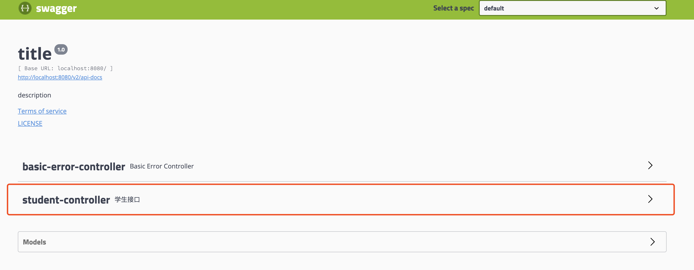
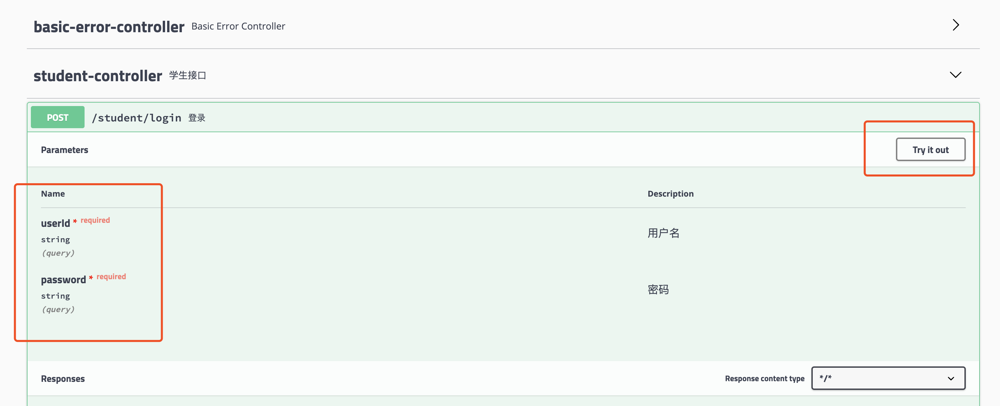
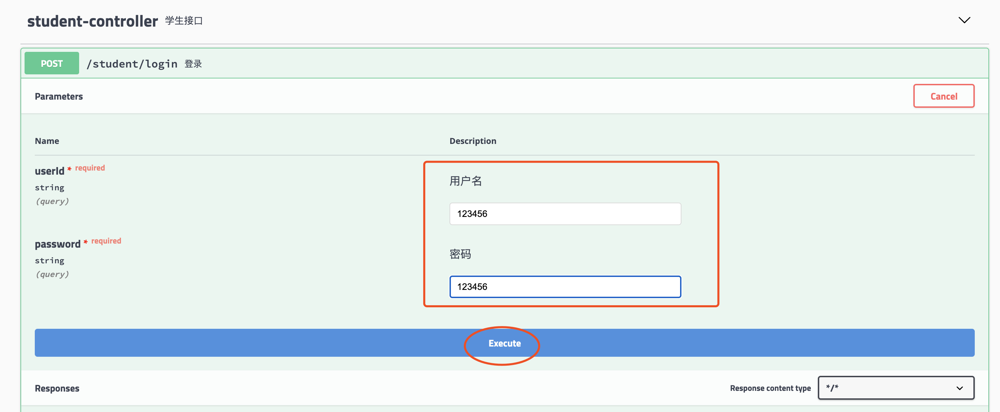
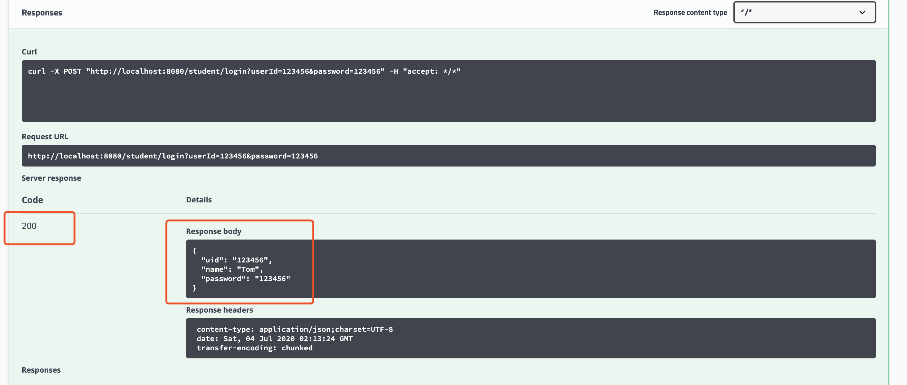

## Spring Boot Swagger
### Swagger介绍
Swagger是最流行的API开发工具，它遵循OpenAPI Specification（OpenAPI规范，简称OAS）。Swagger可以贯穿于整个API生态，如API的设计、编写API文档、测试和部署。

Swagger是一个规范和完整的框架，用于生成、描述、调用和可视化 RestFul 风格的 Web 服务。总体目标是使客户端和文件系统作为服务器以同样的速度来更新。文件的方法、参数和模型紧密集成到服务器端的代码，允许API来始终保持同步。

可以用于接口文档在线生成以及功能测试。

### 1. pom.xml引入相关jar包
```xml
<!-- swagger-ui -->
<dependency>
    <groupId>io.springfox</groupId>
    <artifactId>springfox-swagger-ui</artifactId>
    <version>2.8.0</version>
</dependency>
<!-- swagger -->
<dependency>
    <groupId>io.springfox</groupId>
    <artifactId>springfox-swagger2</artifactId>
    <version>2.8.0</version>
</dependency>
```

### 2. 编写相关配置类
```java
@Api(value = "/api", description = "swagger示例接口", tags = "example")
@RestController
@RequestMapping(value = "/api", produces = {"application/json"})
public class Swagger2Configuration {
    @Bean
    public Docket api() {
        return new Docket(DocumentationType.SWAGGER_2)
                .select()//build模式,返回一个建造者
                .apis(RequestHandlerSelectors.any())//api的配置路径
                .paths(PathSelectors.any())//扫描路径选择
                .build()
                .apiInfo(apiInfo());
    }

    private ApiInfo apiInfo() {
        return new ApiInfoBuilder()
                .title("title") //文档标题
                .description("description")//接口概述
                .version("1.0") //版本号
                .termsOfServiceUrl(String.format("url"))//服务的域名
                .license("LICENSE")//证书
                .licenseUrl("http://www.guangxu.com")//证书的url
                .build();
    }
}
```

### 3. Controller引入相关注解
```java
@Api(description = "学生接口 ")
@RestController
@RequestMapping(value = "/student")
public class StudentController {

    /** 学生服务 */
    @Autowired
    private StudentService studentService;

    @ApiOperation(value = "登录")
    @ApiImplicitParams({@ApiImplicitParam(name = "userId", value = "用户名", required = true, dataType = "String"),
            @ApiImplicitParam(name = "password", value = "密码", required = true, dataType = "String")})
    @PostMapping("/login")
    public Student login(String userId, String password){
        return studentService.query(userId, password);
    }

}
```

### 4. Application加入注解
```java
@SpringBootApplication
@EnableSwagger2
public class SwaggerApplication {

    public static void main(String[] args) {
        SpringApplication.run(SwaggerApplication.class, args);
    }

}
```

### 5. 运行并访问如下链接, 即可进行查看和测试

http://localhost:8080/stable/swagger-ui.html

stable表示版本号，配置方式在application.yml里面

打开文档，选择待测试的接口

### Swagger注解说明

官方文档：https://editor.swagger.io/

打开待测试的文档，选择测试接口

可以看到对应的参数信息，点击Try It Out

输入参数，点击执行

下方可以看到执行结果

- @Api：用在类上，说明该类的作用。
- @ApiOperation：给API增加方法说明。
- @ApiImplicitParams : 用在方法上包含多个参数说明。
- @ApiImplicitParam：用在方法上包含一个参数说明。
```text
paramType：指定参数放在哪个地方。
name：参数名
dataType：参数类型
required：参数是否必须传
value：说明参数
defaultValue：参数的默认值
```
注：paramType类型
```text
header：请求参数放置于Request Header，使用@RequestHeader 获取。
query：请求参数放置于请求地址，使用@RequestParam获取
path：用于restful接口。
@PathVariable：获取请求参数。
body
form
```
- @ApiResponses：用于表示一组响应。
- @ApiResponse：用在@ApiResponses中，一般用于表达一个错误的响应信息。
```text
code：数字，例如400
message：信息，例如"请求参数没填好"。
response：抛出异常的类
```
- @ApiModel：描述一个Model的信息（一般用在请求参数无法使用@ApiImplicitParam注解进行描述的时候）。
- @ApiModelProperty：描述一个model的属性。

### 关于Restful

1、GET(select)  请求会向数据库发索取数据的请求，从而来获取信息,其只是用来查询一下数据，不会修改、增加数据，不会影响资源的内容。无论进行多少次操作，结果都是一样的。

2、PUT(update)  请求是向服务器端发送数据的，从而改变信息，其用来修改数据的内容，但是不会增加数据的种类等，无论进行多少次PUT操作，其结果并没有不同。

3、POST(insert) 请求同PUT请求类似，都是向服务器端发送数据的，但是该请求会改变数据的种类等资源.几乎目前所有的提交操作都是用POST请求的。

4、DELETE(delete) 请求是用来删除某一个资源的。

POST主要作用在一个集合资源之上的（url），而PUT主要作用在一个具体资源之上的（url/xxx）.如URL可以在客户端确定，那么可使用PUT，否则用POST。
一个URL地址，它用于描述一个网络上的资源，而HTTP中的GET，POST，PUT，DELETE就对应着对这个资源的查，改，增，删4个操作。


